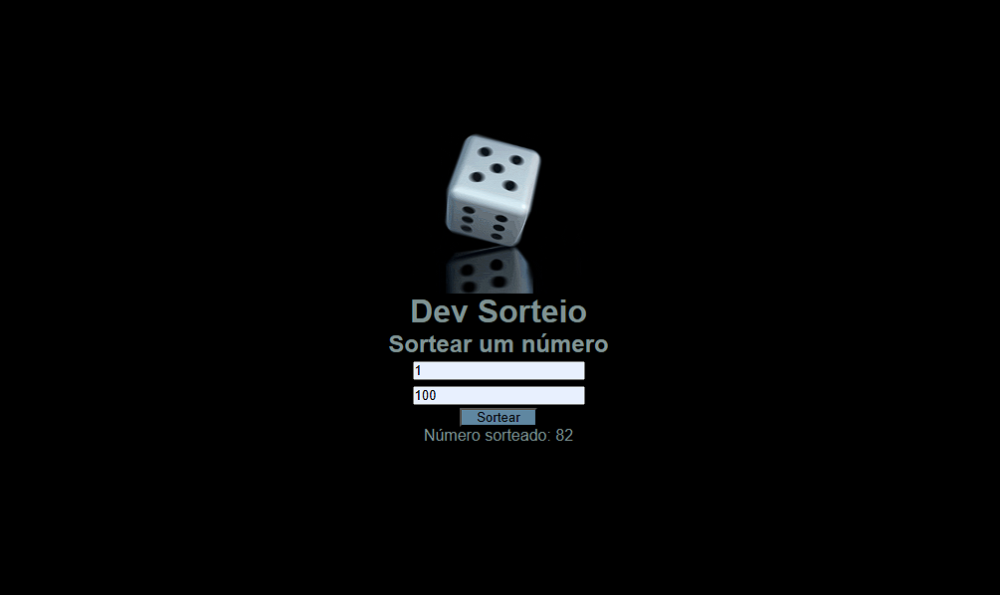

<h1>Dev Sorteio 🲠 </h1> 

 O Dev Sorteio é uma aplicação web simples e eficiente para realizar sorteios de forma rápida e prática. Basta inserir os participantes e deixar que o sistema escolha um vencedor automaticamente!

<h2>🚀 Funcionalidades</h2>
Adicionar uma lista de participantes

Sortear um vencedor aleatoriamente

Interface intuitiva e fácil de usar

<h2>🔧 Tecnologias Utilizadas</h2>
 HTML, CSS, JavaScript.

Sinta-se à vontade para contribuir ou deixar seu feedback! 😃

